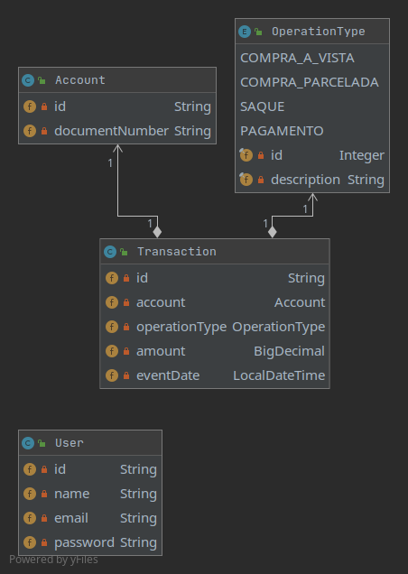

# Pismo Demo - API

## About

This is a demo project for practicing Spring API. The idea was to build some basic account and transactions endpoints.

It was made using **Spring Boot**, **Spring Security**, **Spring Data**, **Mongo DB** and **Docker**. 
Database is NoSQL **MongoDB**.

There is a login functionality included because all of the endpoints are safe and need a JWT token in the header for authentication.

The documentation of API is published on http://IP:8080/swagger-ui/index.html.

The data structure is represented in the class diagram below:



## Configuration

### Configuration Files

#### API
Folder **api/src/resources/** contains config files for **Pismo Demo - API** Spring Boot application.

## How to run (API)

There are several ways to run the application. You can run it from the command line with included Maven or Docker. 

### Mongo

To run the application is necessary MongoDB database installed, if you don't have you can install using docker, like this:

```bash
$ docker pull mongo
```

The command below list the MongoDB image created:

```bash
$ docker ps -a |grep mongo
b5edf3af5290        mongo     "docker-entrypoint.s…"   53 minutes ago    Exited (0) 11 minutes ago                                                       pismo-demo-mongodb
80663d05925a        mongo     "docker-entrypoint.s…"   4 days ago        Exited (0) About an hour ago                                                      focused_blackburn
```

If you have more than one, choose the id of one and start the image:

```bash
$ docker start 80663d05925a
```

### Maven

Open a terminal and run the following commands to ensure that you have valid versions of Java and Maven installed:

```bash
$ java -version
java version "1.8.0_181"
Java(TM) SE Runtime Environment (build 1.8.0_181-b13)
Java HotSpot(TM) 64-Bit Server VM (build 25.181-b13, mixed mode)
```

```bash
$ mvn -v
Apache Maven 3.6.2 (40f52333136460af0dc0d7232c0dc0bcf0d9e117; 2019-08-27T12:06:16-03:00)
Maven home: /Users/manny/Java/apache-maven-3.6.2
Java version: 1.8.0_181, vendor: Oracle Corporation, runtime: /Library/Java/JavaVirtualMachines/jdk1.8.0_181.jdk/Contents/Home/jre
Default locale: en_US, platform encoding: UTF-8
OS name: "mac os x", version: "10.15.1", arch: "x86_64", family: "mac"
```

#### Using the Maven Plugin

The Spring Boot Maven plugin includes a run goal that can be used to quickly compile and run your application. 
Applications run in an exploded form, as they do in your IDE. 
The following example shows a typical Maven command to run a Spring Boot application:

Folder **pismo_demo_api/**
 
```bash
$ mvn spring-boot:run
``` 

#### Using Executable Jar

To create an executable jar run:

```bash
$ mvn clean package
``` 

To run that application, use the java -jar command, as follows:

```bash
$ java -jar target/demo-api-0.0.1-SNAPSHOT.jar
```

### Docker (API)

It is possible to run **pismo-demo-api** using Docker:

Folder **pismo_demo_api/**

Build Docker image:
```bash
$ mvn clean package -Pdocker -DskipTests=true
$ docker-compose build
```

Run Docker container:
```bash
$ docker-compose up
```


## Docker 

* **Dockerfile** - Docker build file for executing pismo-demo-api Docker images. 
Instructions to build artifacts, copy build artifacts to docker image and then run app on proper port with proper configuration file.

## Extra 

In folder **postman** has files **PISMO-DEMO-DSV.postman_environment.json** and **PISMO_DEMO_API.postman_collection.json** to import on Postman app and they can use to test API.

In file **PISMO-DEMO-DSV.postman_environment.json** has all environment variables to call API.

Before calling any request, the request LOGIN needs to call. This request authenticate and generate a JWT token and set on **ACCESS_TOKEN** to send in other requests.